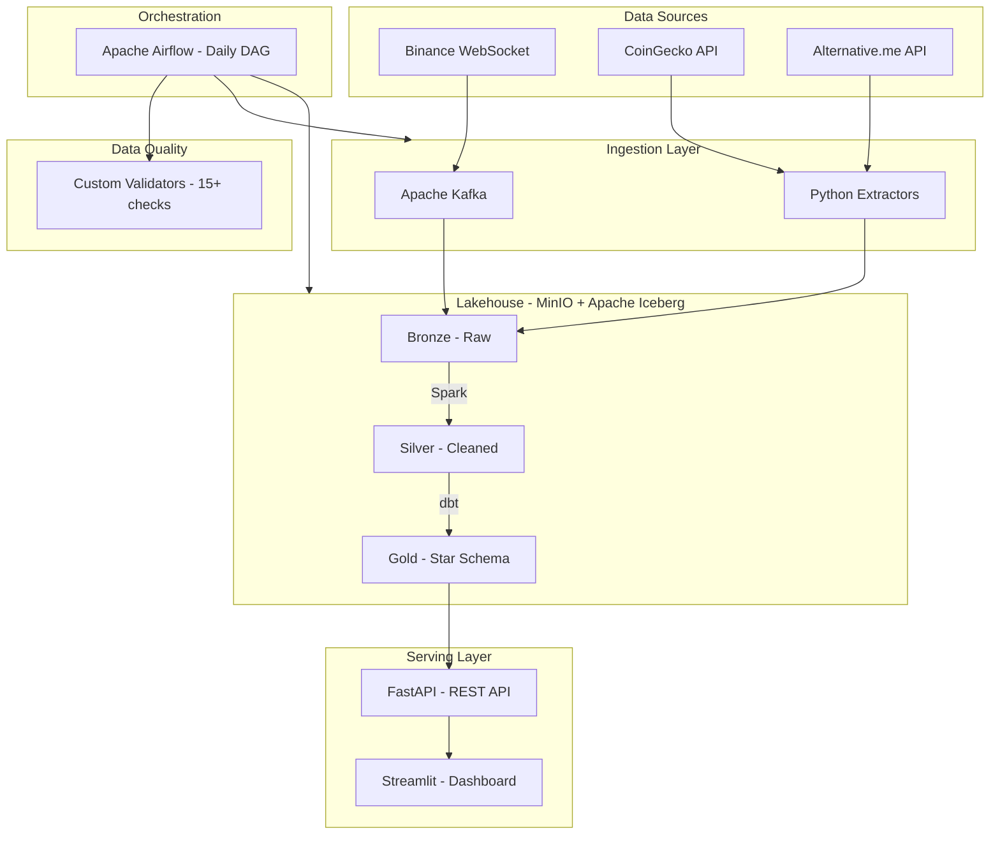

# 🏔️ CryptoLake — Real-Time Crypto Analytics Lakehouse

[](https://github.com/joseluis-m/cryptolake/actions/workflows/ci.yml)
[](https://python.org)
[](https://spark.apache.org)
[](https://iceberg.apache.org)
[](https://getdbt.com)
[](https://airflow.apache.org)
[](LICENSE)

> An end-to-end **data engineering platform** that ingests real-time and historical
> cryptocurrency data, processes it through a **Medallion Architecture**
> (Bronze → Silver → Gold) on **Apache Iceberg**, transforms with **dbt**,
> orchestrates with **Airflow**, validates with automated quality checks,
> and serves analytics via **REST API** and **interactive dashboard** —
> all containerized with Docker and provisioned with Terraform.

---

## Architecture



## Tech Stack

| Layer | Technology | Version | Purpose |
|-------|-----------|---------|---------|
| **Streaming** | Apache Kafka (KRaft) | 7.6 | Real-time price ingestion via WebSocket |
| **Processing** | Apache Spark | 3.5.3 | Distributed batch processing (PySpark) |
| **Table Format** | Apache Iceberg | 1.5.2 | ACID transactions, time travel, schema evolution |
| **Storage** | MinIO | Latest | S3-compatible object storage (local dev) |
| **Transformation** | dbt-core + dbt-spark | 1.8 | SQL-based dimensional modeling (Kimball star schema) |
| **Orchestration** | Apache Airflow | 2.9.3 | DAG scheduling, monitoring, and retry logic |
| **Data Quality** | Custom Python Framework | — | 15+ validation checks with Iceberg-persisted results |
| **API** | FastAPI | 0.110 | REST API with auto-generated Swagger/ReDoc docs |
| **Dashboard** | Streamlit + Plotly | — | Interactive charts (price trends, moving averages, F&G) |
| **Containers** | Docker Compose | — | 12-service local environment |
| **IaC** | Terraform | 1.8+ | AWS S3 bucket provisioning with lifecycle policies |
| **CI/CD** | GitHub Actions | — | 4-job pipeline: lint → test → dbt compile → Docker build |
| **Code Quality** | Ruff + pre-commit | 0.3+ | Linting, formatting, and git hooks |

## Quick Start

**Prerequisites:** Docker Desktop (6+ CPU cores, 8+ GB RAM), Python 3.11+, Make

```bash
git clone https://github.com/joseluis-m/cryptolake.git
cd cryptolake
cp .env.example .env
make up          # Start 12+ containers
make pipeline    # Run full ETL: Bronze → Silver → Gold → Quality
```

| Service | URL | Credentials |
|---------|-----|-------------|
| API Docs (Swagger) | http://localhost:8000/docs | — |
| API Docs (ReDoc) | http://localhost:8000/redoc | — |
| Dashboard | http://localhost:8501 | — |
| Airflow UI | http://localhost:8083 | admin / admin |
| MinIO Console | http://localhost:9001 | cryptolake / cryptolake123 |
| Spark Master UI | http://localhost:8082 | — |
| Kafka UI | http://localhost:8080 | — |

## Data Model

### Medallion Architecture (Bronze → Silver → Gold)

```
Bronze (Raw)                Silver (Cleaned)             Gold (Analytics-Ready)
──────────────              ─────────────────            ──────────────────────
historical_prices           daily_prices                 fact_market_daily
  coin_id                     coin_id                      coin_id (FK → dim_coins)
  timestamp_ms      ──►       price_date         ──►       price_date (FK → dim_dates)
  price_usd                   price_usd                    price_usd
  market_cap_usd              market_cap_usd               moving_avg_7d, moving_avg_30d
  volume_24h_usd              volume_24h_usd               volatility_7d, avg_volume_7d
  _ingested_at                _processed_at                price_change_pct_1d
  _source                                                  fear_greed_value
  _loaded_at                                               market_sentiment
                                                           sentiment_score, ma30_signal
fear_greed                  fear_greed
  value                       index_date                 dim_coins (SCD Type 1)
  classification              fear_greed_value             coin_id (PK)
  timestamp                   classification               all_time_high, all_time_low
  _ingested_at                _processed_at                avg_price, avg_daily_volume
  _source                                                  total_days_tracked
  _loaded_at
                                                         dim_dates (Calendar)
                                                           date_day (PK)
                                                           year, month, quarter
                                                           is_weekend, day_name
```

### Star Schema (Gold Layer — dbt)

```
              ┌─────────────────────┐
              │     dim_dates       │
              │     ─────────       │
              │  date_day (PK)      │◄───┐
              │  year, month, day   │    │
              │  quarter, week      │    │
              │  is_weekend         │    │
              │  day_name           │    │
              └─────────────────────┘    │
                                         │ price_date = date_day
┌─────────────────────┐   ┌──────────────┴────────────────────────┐
│     dim_coins       │   │        fact_market_daily              │
│     ─────────       │   │        ──────────────────             │
│  coin_id (PK)       │◄──┤  coin_id (FK)                         │
│  first_tracked      │   │  price_date (FK)                      │
│  last_tracked       │   │  price_usd, market_cap_usd            │
│  total_days         │   │  volume_24h_usd                       │
│  all_time_high      │   │  price_change_pct_1d                  │
│  all_time_low       │   │  moving_avg_7d, moving_avg_30d        │
│  avg_price          │   │  volatility_7d, avg_volume_7d         │
│  avg_daily_volume   │   │  fear_greed_value, market_sentiment   │
│  price_range_pct    │   │  sentiment_score, ma30_signal         │
└─────────────────────┘   └───────────────────────────────────────┘
```

## Key Features

**Data Platform**
- **Medallion Architecture** on Apache Iceberg with ACID guarantees and time travel
- **Dual ingestion** — real-time streaming (Kafka + Binance WebSocket) and daily batch (CoinGecko, Alternative.me)
- **Incremental processing** — Spark MERGE INTO for efficient deduplication in Silver
- **Dimensional modeling** — Kimball star schema with window functions (MA7, MA30, volatility, sentiment scoring)

**Quality & Operations**
- **15+ automated data quality checks** — schema validation, freshness, referential integrity, value ranges
- **Quality results persisted** to Iceberg table (`quality.check_results`) for historical tracking
- **Airflow DAG** with TaskGroups — full pipeline: Ingest → Bronze → Silver → dbt → Quality
- **CI/CD pipeline** — 4 parallel jobs: ruff lint, pytest, dbt compile, Docker build

**Serving**
- **FastAPI REST API** with auto-generated Swagger and ReDoc documentation
- **Streamlit dashboard** with Plotly charts — price trends, moving averages, Fear & Greed Index
- **Terraform IaC** — modular AWS S3 provisioning with Glacier lifecycle and versioning

## Project Structure

```
cryptolake/
├── .github/
│   └── workflows/
│       ├── ci.yml                  # CI: lint → test → dbt → docker-build
│       └── data-quality.yml        # Manual quality validation trigger
├── docker/
│   ├── airflow/Dockerfile          # Airflow 2.9 + dbt in isolated venv
│   ├── api/Dockerfile              # FastAPI + PyHive
│   └── spark/
│       ├── Dockerfile              # Spark 3.5 + Iceberg JARs + Kafka JARs
│       └── spark-defaults.conf     # Iceberg catalog + S3 config
├── docs/
│   ├── architecture.md             # 6 Architecture Decision Records
│   ├── data_dictionary.md          # Every field in every table
│   ├── data_contracts/             # YAML schema contracts (Bronze, Silver)
│   ├── diagrams/                   # Mermaid architecture diagram
│   └── setup_guide.md             # Zero-to-running guide
├── src/
│   ├── config/                     # Pydantic settings + structured logging
│   ├── ingestion/
│   │   ├── batch/                  # CoinGecko + Fear & Greed extractors
│   │   └── streaming/              # Binance WebSocket → Kafka producer
│   ├── processing/
│   │   └── batch/                  # api_to_bronze, bronze_to_silver, init_namespaces
│   ├── transformation/
│   │   └── dbt_cryptolake/         # dbt project: staging + marts (star schema)
│   ├── quality/                    # Custom validator framework (Bronze/Silver/Gold)
│   ├── orchestration/
│   │   └── dags/                   # Airflow DAG with TaskGroups
│   └── serving/
│       ├── api/                    # FastAPI routes, Pydantic schemas, PyHive
│       └── dashboard/              # Streamlit + Plotly app
├── terraform/
│   ├── modules/storage/            # S3 buckets + lifecycle + versioning
│   └── environments/               # Local (MinIO) + AWS configs
├── tests/
│   ├── unit/                       # Pytest: API schemas + quality structures
│   └── integration/                # Integration test stubs
├── docker-compose.yml              # 12 services orchestrated
├── Makefile                        # 25+ developer commands
├── pyproject.toml                  # Project config + dev dependencies
├── ruff.toml                       # Linter configuration
├── .pre-commit-config.yaml         # Git hooks (ruff)
└── .env.example                    # Environment variables template
```

## Testing & Quality

```bash
# Code quality
ruff check src/ tests/              # Linting (0 errors)
ruff format --check src/ tests/     # Formatting verification
pytest tests/unit/ -v --cov=src     # 8 unit tests with coverage

# dbt validation
cd src/transformation/dbt_cryptolake
dbt compile --profiles-dir . --target ci   # Validates all SQL models

# Data quality (requires running services)
make quality-check                  # 15+ checks across Bronze/Silver/Gold
make quality-bronze                 # Layer-specific checks
make quality-silver
make quality-gold
```

## Documentation

| Document | Description |
|----------|-------------|
| [Architecture Decision Records](docs/architecture.md) | 6 ADRs: why Iceberg over Delta Lake, why dbt over pure Spark, why Airflow over Prefect, etc. |
| [Data Dictionary](docs/data_dictionary.md) | Every column in every table across all layers, with types and descriptions |
| [Data Contracts](docs/data_contracts/) | YAML schema contracts defining quality rules, freshness SLAs, and constraints |
| [Setup Guide](docs/setup_guide.md) | Step-by-step from zero prerequisites to running pipeline with troubleshooting |

## What I Learned

Building CryptoLake was an exercise in integrating production-grade tools into a cohesive data platform:

1. **Iceberg is production-ready** — ACID transactions, time travel, and schema evolution on object storage eliminate the need for traditional warehouses for many analytical workloads. The REST catalog makes it straightforward to share metadata across Spark, dbt, and other engines.

2. **dbt + Spark requires careful isolation** — Running dbt-spark inside Airflow containers triggers protobuf version conflicts. The solution was isolating dbt in a dedicated Python virtualenv within the Airflow Docker image and using environment variable overrides to prevent package leaking.

3. **Data quality catches real bugs** — Automated validators caught null prices from API rate limiting, duplicate records from overlapping date ranges, and stale timestamps from timezone mismatches. Persisting check results to Iceberg enables trend analysis of data health over time.

4. **Docker Compose at scale teaches infrastructure** — Running 12+ services locally forced me to learn health check dependencies, resource limits, startup ordering, and volume management. These are the same concerns that matter in Kubernetes production deployments.

5. **The Medallion pattern enables independent debugging** — When the Gold layer produces unexpected results, I can query Silver and Bronze independently to isolate whether the issue is in ingestion, cleaning, or transformation. Each layer is a checkpoint.

## License

This project is licensed under the MIT License — see [LICENSE](LICENSE).

---

*Built by [José Luis Moreno](https://github.com/joseluis-m) as a Data Engineering portfolio project demonstrating production-grade practices with modern data stack technologies.*
