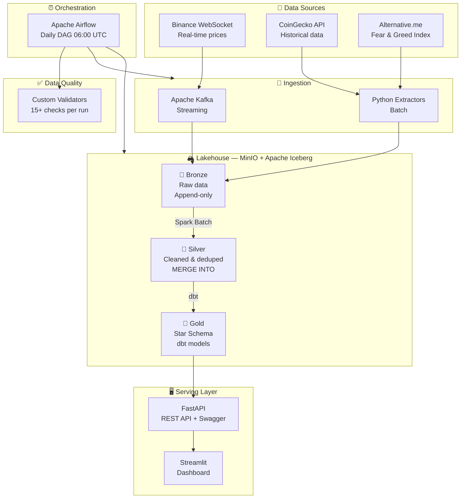

# 🏔️ CryptoLake — Real-Time Crypto Analytics Lakehouse

[](https://github.com/tu-usuario/cryptolake/actions/workflows/ci.yml)
[](https://python.org)
[](https://spark.apache.org)
[](https://iceberg.apache.org)
[](https://getdbt.com)
[](https://airflow.apache.org)
[](LICENSE)

> An end-to-end data engineering platform that ingests real-time and historical
> cryptocurrency data, processes it through a **Medallion Architecture**
> (Bronze → Silver → Gold) on **Apache Iceberg**, transforms with **dbt**,
> orchestrates with **Airflow**, validates with automated quality checks,
> and serves analytics via **REST API** and **interactive dashboard** —
> all containerized with Docker and provisioned with Terraform.

---

## 🏗️ Architecture



## 🛠️ Tech Stack

| Layer | Technology | Version | Purpose |
|-------|-----------|---------|---------|
| **Streaming** | Apache Kafka | 3.7 | Real-time price ingestion from Binance |
| **Processing** | Apache Spark | 3.5 | Batch + stream processing (PySpark) |
| **Table Format** | Apache Iceberg | 1.5 | ACID transactions, time travel, schema evolution |
| **Storage** | MinIO | Latest | S3-compatible object storage |
| **Transformation** | dbt-core + dbt-spark | 1.8 | SQL-based dimensional modeling (Kimball) |
| **Orchestration** | Apache Airflow | 2.9 | Pipeline scheduling and monitoring |
| **Data Quality** | Custom Framework | — | 15+ automated validation checks |
| **API** | FastAPI | 0.110 | REST API with auto-generated docs |
| **Dashboard** | Streamlit | 1.35+ | Interactive visualizations (Plotly) |
| **Infrastructure** | Docker Compose | 24+ | Local containerized environment |
| **IaC** | Terraform | 1.8+ | AWS S3 provisioning |
| **CI/CD** | GitHub Actions | — | Automated testing and deployment |
| **Code Quality** | Ruff | 0.3+ | Linting + formatting |

## 🚀 Quick Start

### Prerequisites

- Docker Desktop (6+ CPU cores, 8+ GB RAM)
- Python 3.11+
- Make

### Setup

```bash
# Clone the repository
git clone https://github.com/tu-usuario/cryptolake.git
cd cryptolake

# Configure environment
cp .env.example .env

# Start all services (12+ containers)
make up

# Run the full pipeline
make pipeline
```

### Access Points

| Service | URL |
|---------|-----|
| **API Docs (Swagger)** | http://localhost:8000/docs |
| **Dashboard** | http://localhost:8501 |
| **Airflow UI** | http://localhost:8083 (admin/admin) |
| **MinIO Console** | http://localhost:9001 (cryptolake/cryptolake123) |
| **Spark UI** | http://localhost:8082 |
| **Kafka UI** | http://localhost:8080 |

## 📊 Data Model

### Medallion Architecture

```
Bronze (Raw)              Silver (Cleaned)           Gold (Business-Ready)
─────────────             ────────────────           ────────────────────
historical_prices         daily_prices               fact_market_daily
  coin_id                   coin_id                    coin_id (FK)
  timestamp_ms    ──►       price_date       ──►       price_date (FK)
  price_usd                 price_usd                  price_usd
  market_cap_usd            market_cap_usd             moving_avg_7d/30d
  volume_24h_usd            volume_24h_usd             volatility_7d
  _ingested_at              _processed_at              fear_greed_value
  _source                                              ma30_signal
  _loaded_at                                           combined_signal

fear_greed                fear_greed                 dim_coins
  value                     index_date                 coin_id (PK)
  classification            fear_greed_value           all_time_high
  timestamp                 classification             avg_price
  _ingested_at              _processed_at              total_days_tracked
  _source
  _loaded_at                                         dim_dates
                                                       date_day (PK)
                                                       year, month, quarter
                                                       is_weekend
```

### Star Schema (Gold Layer)

```
              ┌───────────────────┐
              │    dim_dates      │
              │    ──────────     │
              │  date_day (PK)   │◄──┐
              │  year, month     │   │
              │  quarter         │   │
              │  is_weekend      │   │
              │  day_name        │   │
              └───────────────────┘   │
                                     │  price_date = date_day
┌───────────────────┐   ┌────────────┴─────────────────────────┐
│    dim_coins      │   │       fact_market_daily               │
│    ──────────     │   │       ──────────────────              │
│  coin_id (PK)    │◄──┤  coin_id (FK)                         │
│  first_tracked   │   │  price_date (FK)                      │
│  all_time_high   │   │  price_usd                            │
│  avg_price       │   │  market_cap_usd, volume_24h_usd       │
│  avg_daily_vol   │   │  price_change_pct_1d                  │
│  price_range_pct │   │  moving_avg_7d, moving_avg_30d        │
└───────────────────┘   │  volatility_7d, avg_volume_7d         │
                        │  fear_greed_value, market_sentiment    │
                        │  ma30_signal, combined_signal          │
                        └────────────────────────────────────────┘
```

## 📈 Key Features

- **Medallion Architecture** — Bronze → Silver → Gold on Apache Iceberg
- **Dual Pipeline** — Real-time streaming (Kafka) + daily batch (CoinGecko API)
- **Dimensional Modeling** — Kimball star schema with facts and dimensions
- **Incremental Processing** — MERGE INTO for efficient upserts in Silver
- **Automated Quality** — 15+ data quality checks across all layers
- **REST API** — FastAPI with Swagger docs, serving Gold layer analytics
- **Interactive Dashboard** — Streamlit with Plotly charts
- **Full Orchestration** — Airflow DAG: Ingest → Bronze → Silver → Gold → Quality
- **CI/CD** — GitHub Actions: lint, test, dbt compile, Docker build
- **Infrastructure as Code** — Terraform modules for AWS S3 provisioning

## 🗂️ Project Structure

```
cryptolake/
├── .github/workflows/          # CI/CD pipelines
│   ├── ci.yml                  # Lint → Test → dbt → Docker
│   └── data-quality.yml        # Manual quality validation
├── docker/                     # Dockerfiles
│   ├── spark/                  # Spark + Iceberg JARs
│   ├── airflow/                # Airflow + dbt virtualenv
│   └── api/                    # FastAPI
├── terraform/                  # Infrastructure as Code
│   ├── modules/storage/        # S3 bucket definitions
│   └── environments/           # Local + AWS configs
├── src/
│   ├── config/                 # Pydantic settings
│   ├── ingestion/              # Kafka producer + API extractors
│   ├── processing/batch/       # Spark jobs (Bronze→Silver→Gold)
│   ├── transformation/         # dbt project (star schema)
│   ├── quality/                # Data quality validators
│   ├── orchestration/dags/     # Airflow DAG
│   └── serving/                # FastAPI + Streamlit
├── tests/                      # Pytest unit tests
├── docs/                       # Architecture, data dictionary, contracts
├── docker-compose.yml
├── Makefile
└── README.md
```

## 🧪 Testing & Quality

```bash
# Linting
ruff check src/ tests/

# Unit tests
pytest tests/unit/ -v

# dbt model validation
cd src/transformation/dbt_cryptolake && dbt compile --target ci

# Data quality checks (requires services running)
make quality-check

# Full pipeline
make pipeline
```

## 📖 Documentation

- [Architecture Decision Records](docs/architecture.md) — Why Iceberg, dbt, Airflow, etc.
- [Data Dictionary](docs/data_dictionary.md) — Every field in every table documented
- [Data Contracts](docs/data_contracts/) — Schema agreements between pipeline stages
- [Setup Guide](docs/setup_guide.md) — Step-by-step from zero to running

## 🎓 What I Learned

Building CryptoLake was an exercise in integrating production-grade tools
into a cohesive data platform. Key takeaways:

1. **Iceberg is the future** — ACID transactions, time travel, and schema
   evolution on object storage eliminate the need for traditional data
   warehouses for many use cases.

2. **dbt + Spark is powerful but tricky** — The Thrift Server bridge works
   well, but requires careful isolation of Python environments to avoid
   dependency conflicts (protobuf versions between Airflow and dbt).

3. **Docker Compose has limits** — Running 12+ services locally requires
   careful resource management. Learned to optimize images, health checks,
   and startup ordering.

4. **Data quality is not optional** — Automated validation caught several
   issues with API data (null prices, duplicate records, stale timestamps)
   that would have silently corrupted downstream analytics.

5. **The Medallion pattern scales** — Separating raw ingestion (Bronze),
   cleaning (Silver), and business modeling (Gold) makes each layer
   independently testable and debuggable.

## 📄 License

This project is licensed under the MIT License — see [LICENSE](LICENSE).

---

*Built as a Data Engineering portfolio project demonstrating production-grade
practices with modern data stack technologies.*

